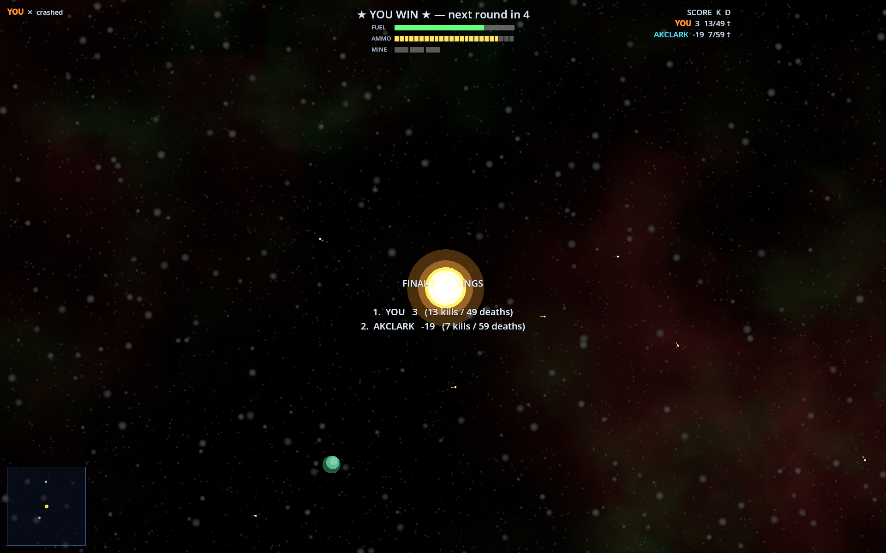
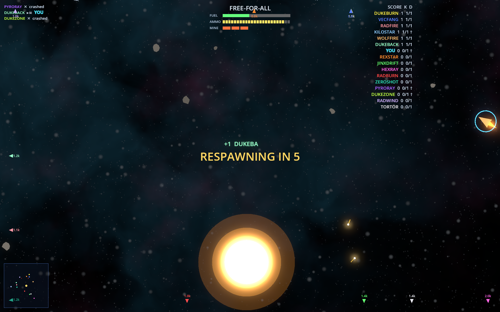

# XSpaceWar-AI

[](https://github.com/CryptoJones/XSpaceWar-AI/actions/workflows/ci.yml)
[](https://github.com/CryptoJones/XSpaceWar-AI/releases/latest)
[](LICENSE)
[](https://godotengine.org)
[](https://github.com/CryptoJones/XSpaceWar-AI/releases/latest)
[](https://codeberg.org/CryptoJones/XSpaceWar-AI)

A modern, AAA-styled networked **space-fighter** with a strong AI focus — a
2026 reimagining of the classic networked *Spacewar!* / `xspacewar`. Bird's-eye
view like the original, but with
**space-accurate Newtonian physics**, **100% procedurally-generated graphics**
(no hand-drawn art assets), and **LAN + internet multiplayer for up to 16
ships**.

Built with **Godot 4** for **Windows, Linux, and macOS**. Licensed under
**Apache 2.0**.

## Get it

[](https://github.com/CryptoJones/XSpaceWar-AI/releases/latest)
[](https://cryptojones.itch.io/xspacewar-ai)
[](https://store.steampowered.com)
[](https://cryptojones.github.io/XSpaceWar-AI/)

> **macOS:** the build is Developer ID signed but not notarized — if Gatekeeper blocks it, see [Running on macOS](#running-on-macos).

## Screenshots

**The first networked match.** Dedicated server on one machine, two pilots
joining from two more — and the human (holding nearly still) beats the AI
**3 to −19**, while the bot drowns in the star fifty-nine times. Newtonian
gravity is undefeated:



The gravity well takes another victim:



---

## Heritage

XSpaceWar-AI stands on the shoulders of one of gaming's oldest lineages:

- **Spacewar!** — MIT, 1962, on the DEC **PDP-1** (Steve Russell et al.).
- **PDP-11 port** — Bill Seiler & Larry Bryant, 1974. The networked
  space-fighter spirit this project carries forward.
- **xspacewar 1.2** — an **X11/C** version written by **Ron Frederick** in
  **1992**, an early *serverless* networked multiplayer game where peers shared
  state directly (IP unicast/multicast) and each client simulated independently.

This is an **original clean-room implementation** — see [`NOTICE`](NOTICE) for
full attribution. Huge thanks to **Ron Frederick**
([github.com/ronf](https://github.com/ronf) ·
[webrtc-spacewar](https://github.com/ronf/webrtc-spacewar) ·
[timeheart.net/spacewar](https://www.timeheart.net/spacewar)) whose 1992
networked Spacewar is this game's direct ancestor.

## Features

- Top-down arena dogfights around a gravity well, up to **16 ships**.
- Modern **Newtonian** flight — conserved momentum, inverse-square gravity on
  ships *and* torpedoes, gravity-assist slingshots, hyperspace.
- **Procedurally generated everything** — stars, planets, moons, asteroid
  fields, nebulae, ships, VFX, *and audio* (every sound is synthesized from
  math at load) — every match a new seeded arena.
- **Game modes:** Free-for-all, Team battle, AI bots (Rookie → Insane), and
  **Movie Mode** — an all-AI spectator attract that regenerates a fresh
  arena, roster, and teams every 30 minutes.
- **Multiplayer (working today):** host-authoritative netcode with
  client-side prediction + reconciliation, automatic **LAN discovery**,
  **direct IP**, and platform-agnostic **internet play** via this repo's own
  relay/master server — room codes, an online server browser, and no port
  forwarding or platform services required.

## Physics — what's real, and the one thing that isn't

The simulation is **honest Newtonian mechanics**, and we keep it that way on
purpose:

- **Gravity is pure inverse-square.** Every body pulls with `G·M / r²` —
  no caps, no clamps, no softening beyond a hair inside the star's own
  radius (to avoid a divide-by-zero singularity). Fly close to a star and
  the pull genuinely diverges, exactly as it should; you cannot thrust your
  way out of a star you've already fallen into. That's not a bug, it's a
  star.
- **No drag.** Momentum is conserved. There is no brake — to slow down you
  rotate 180° and burn against your velocity, the same maneuver Spacewar!
  pilots have flown since 1962.
- **Space is a torus.** Crossing a map edge teleports you to the opposite
  side with your **velocity unchanged** — a wrap, not a slingshot. (An
  earlier build doubled your speed at the seam; that was free energy, it
  compounded into an unrecoverable runaway on small maps, and it's gone.)

**The one deliberate deviation — and it isn't a physics fudge, it's level
design:** the star's **mass is sized to the arena**. A smaller map gets a
lighter star. We pick the base mass so that inverse-square gravity at the
spawn ring is a comfortable fraction of your engine's thrust:

```
star_mass = (0.35 · thrust_accel · spawn_radius²) / G
```

so the playfield is always traversable regardless of map size, while the
gravity *law* stays exactly Newtonian. The **Star size** slider then scales
this base from 0.2× to 4×: a giant star really is a brutal, barely-escapable
well, and a dwarf is a gentle nudge — both pure `1/r²`, both honest.

## Multiplayer quick start

- **LAN:** one player clicks *HOST — LAN skirmish*; everyone else sees the
  game in the menu's server list (or uses *JOIN IP*).
- **Internet:** run the relay on any mutually reachable box (a $5 VPS works):

  ```bash
  godot --headless --path . --script res://server/relay_main.gd -- --port 24645
  ```

  Players put `that-box:24645` in the relay field (or set `XSW_RELAY`), the
  host clicks *HOST ONLINE* and shares the 4-letter room code, friends use
  *JOIN CODE* or *BROWSE* (tick *Spectate* to watch without taking a ship).
  Full deployment guide (firewall, systemd): [`server/README.md`](server/README.md).

- **Ports** (all UDP): `24642` game host (open this inbound to host
  direct-internet games; LAN needs nothing) · `24643` LAN discovery
  broadcast (never leaves your subnet) · `24645` relay server (open on
  the VPS; relay *players* need no port forwarding at all).
- **Moderation:** a GUI host opens *PLAYERS* in the in-game menu to kick or
  ban a pilot (ban blocks the callsign, plus the IP on direct/LAN). The
  dedicated server takes `kick`/`ban`/`unban`/`players`/`watch` on its console
  and `--ban NAME` / `--banfile PATH` at launch. Give it a `--banfile` and that
  file becomes the persistent ban store — console `ban`/`unban` are written back
  to it, so they survive a restart. `--record` keeps a bit-exact replay of every
  match as cheating-adjudication evidence. The host also runs aim-anomaly
  heuristics (near-zero aim variance, sub-human acquisition, tracking through
  the wrap seam) and surfaces a ⚠ warning for an operator to review (the
  console's `watch` lists them) — it **never** auto-bans or auto-kicks; acting
  on a flag is always a human call, because perfect input isn't even winning
  play here.

## Project layout

```
src/sim/        Deterministic, render-free game simulation (fixed timestep)
src/net/        Host/join, LAN discovery, matchmaking, platform services
src/gameplay/   Game modes, AI bots, scoring, spawning
src/render/     Procedural shaders, particles, ship/starfield visuals
src/ui/         Menus, server browser, HUD, settings
server/         Standalone relay/master service
tests/          Headless simulation tests
build/          Export presets + CI scripts (Win/Linux/macOS)
```

The simulation in `src/sim/` is **deterministic and headless** (no rendering
deps, fixed timestep) so the authoritative host sim, client-side prediction,
AI, and replay all share one codebase.

## Getting the game

**Prebuilt binaries (no engine needed):** grab the zip for your platform from
the [Releases page](https://github.com/CryptoJones/XSpaceWar-AI/releases).
Every push to `main` also uploads fresh builds as artifacts on the
[Actions tab](https://github.com/CryptoJones/XSpaceWar-AI/actions) (sign-in
required), e.g.:

```bash
gh run download --repo CryptoJones/XSpaceWar-AI -n xspacewar-ai-linux-x86_64
chmod +x xspacewar-ai.x86_64 && ./xspacewar-ai.x86_64
```

## Running from source

**Easiest:** the install script downloads Godot 4.6.3 (SHA-512 verified
against the official release sums), puts it on your PATH, and builds the
project's import cache:

```bash
./install.sh          # Linux (x86_64/arm64) + macOS; safe to re-run
./install.sh --test   # same, then prove it with the headless test suites
godot --path .        # play
```

**Manual route** — the repo ships no engine binary; install **Godot 4.6.x**
(standard build, not .NET) from the
[official releases](https://github.com/godotengine/godot/releases/tag/4.6.3-stable):

```bash
# Linux example
mkdir -p ~/tools/godot ~/.local/bin && cd ~/tools/godot
curl -LO https://github.com/godotengine/godot/releases/download/4.6.3-stable/Godot_v4.6.3-stable_linux.x86_64.zip
unzip Godot_v4.6.3-stable_linux.x86_64.zip && mv Godot_v4.6.3-stable_linux.x86_64 godot

# Put `godot` on your PATH (most distros include ~/.local/bin already):
ln -sf ~/tools/godot/godot ~/.local/bin/godot
godot --version   # if "command not found", open a new shell or use the
                  # full path ~/tools/godot/godot in the commands below
```

(Windows: `Godot_v4.6.3-stable_win64.exe.zip` · macOS:
`Godot_v4.6.3-stable_macos.universal.zip` — same page.)

```bash
# One-time after cloning (or pulling big changes): build the import cache.
# Skipping this can give you a black screen / missing resources on launch.
godot --headless --path . --import

# Run the game
godot --path .

# Run the headless test suites
godot --headless --path . --script res://tests/run_tests.gd       # core sim / physics
godot --headless --path . --script res://tests/combat_tests.gd    # weapons / mines / pickups
godot --headless --path . --script res://tests/bot_tests.gd       # BotController AI
godot --headless --path . --script res://tests/gameplay_tests.gd  # match flow / replay
godot --headless --path . --script res://tests/net_tests.gd       # LAN netcode
godot --headless --path . --script res://tests/relay_tests.gd     # online relay
godot --headless --path . --script res://tests/audio_tests.gd     # synthesis
godot --headless --path . --script res://tests/i18n_tests.gd      # translations
godot --headless --path . --script res://tests/aim_tests.gd       # aim-anomaly heuristics
godot --headless --path . --script res://tests/scene_smoke.gd     # scene boot

# Export release builds locally (needs export templates installed)
build/export_all.sh
```

## Performance on weak GPUs

On bottom-tier integrated graphics (e.g. Intel UHD GT1) the default
Vulkan renderer can stall — the window freezes while the process lives.
The game auto-disables its HDR glow on such adapters, but the robust fix
is the lightweight OpenGL renderer:

```bash
godot --path . --rendering-method gl_compatibility
```

Keeping the OPTIONS → Nebula slider at 0 also helps — the nebula is the
most expensive pixel work in the game.

## Play Testers

To our play testers, who flew the rough builds and filed the truth (alphabetical by
last name): **Roger Bergling**, **Al Bredthauer**, **Samuel Bredthauer**, **Kevin Christiansen (PE)**, **Brad Cramer**,
**Claude Fable 5**, **Trevor Flurry**, **Henry Hannah**, **Patrick Hannah**,
**Noureddine Najah Khalifa**, **Shannon (Learn) Koski**, **Jacob Luff**, **Beaux Onofrio**, **Nick Onofrio**, **Rob Orr**,
**Mark Schantz**, **Adam Testagrossa**, **Nate Tiller**, **John Van Lowe**, and **Jeremy Zhao**.

## Dedication

To **John Van Lowe (JVL)**, for all the nights gaming in 90s-era Dickinson, Texas.
HTMFPWGCBNOTDOD!

## Running on macOS

The macOS build is **Developer ID signed as Patrick Hannah but not notarized**.
The signature protects artifact integrity and identifies its publisher, but on first
launch Gatekeeper may still block the unnotarized download. If that happens, clear the
quarantine flag in Terminal:

```sh
xattr -dr com.apple.quarantine /path/to/XSpaceWar-AI.app
```

> The GitHub release also includes a SHA-256 manifest for the signed archive.

## Mirrors

- GitHub: https://github.com/CryptoJones/XSpaceWar-AI
- Codeberg: https://codeberg.org/CryptoJones/XSpaceWar-AI (auto-synced)

## License

Apache License 2.0 — see [`LICENSE`](LICENSE) and [`NOTICE`](NOTICE).

Proudly Made in Nebraska. Go Big Red! 🌽 https://xkcd.com/2347/
